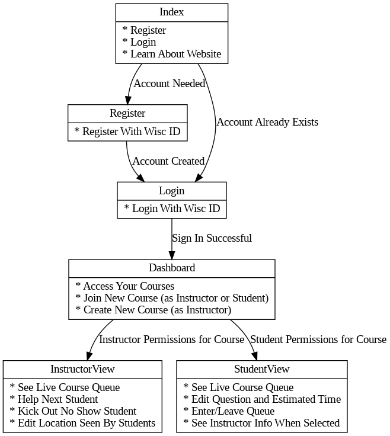
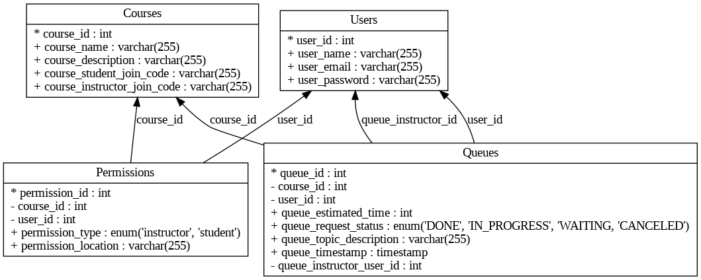

# Welcome to Waitlisters!

Our web application is designed to help college students and instructors organize office hours queues efficiently. It helps students view estimated wait times for help in the courses that they are enrolled in. Moreover, it allows instructors to manage students desiring help in the course that they are teaching. Additional features include  notifying students in real-time of their status on the queue.

It will soon be available for use at `TODO`.

## How To Run

### Run Full Codebase:
0. (If you want to try it, you can use the GUI Docker extension to edit live, although we were running into saving issues there)!
1. Make sure you are in the main waitlisters directory (not waitlisters-backend, not waitlisters-frontend). Once you are in that directory, run:
	- `docker compose up --build`
2. Ports/access:
	- The frontend should be running on localhost:3000
	- The backend should be running on localhost:8080
	- The database is not directly accessible from localhost. Instead, in a new terminal, run:
		`docker exec -it waitlisters-db-1 mysql -u root -ppassword`
	This will open up a mysql shell; A good test command set would be:
`USE waitlist; SELECT * FROM Queues;`
3. Kill all running containers by pressing `ctrl-c` in the terminal/shell.
- To fully stop running the containers, go into the Docker GUI, make sure you are in the 'Containers' section and under 'Actions' click Stop. 
- **This step may be needed to ensure proper waitlist-db adjustments

### Making Codebase Changes:

* Run `git pull` (this ensures that if someone else added something, you are up to date).
* Run `git add *`
 - You can also run `git status` first to ensure what “all”(*) really means.
* Run `git commit -m “<COMMIT-MESSAGE-HERE>” ` 	
* Run `git push`
 - If you ran into problems in the above commands and aren’t sure why, ask!

## Crediting

This code relies on the work of the larger open-source development community. We want to especially thank the developers of Docker, GitHub, OpenAI, Bootstrap, React, NodeJS, and MySQL for their efforts.

# Technical Details

If you notice a mistake or want to try this out yourself, fork away! Note the diagrams below are made using pydot (.ipnyb in this repository).

## Client Accessibility (UX)

### Page Schema

## Data Storage (DB)

### Entity Relationship Diagram

## Network Security (Pen Testing)

We will use a .env file to hide the secrets needed to connect to our database, and OAuth through Google's services to attempt to mitigate unwelcome visitors.

* We will use Synk and Dependabot to test for network security.

## Internet Integration (CI/CD)

This is coming soon to our GitHub workflow!

* We will use Lighthouse for Accessibility and Performance Metrics.

# Further Improvements

See our living backlog [here](https://docs.google.com/spreadsheets/d/1pgrmx3J7-0h1hmzTBVAJzuEH_yD-Rbgq2Av7DAyvyyA/edit?usp=sharing).

