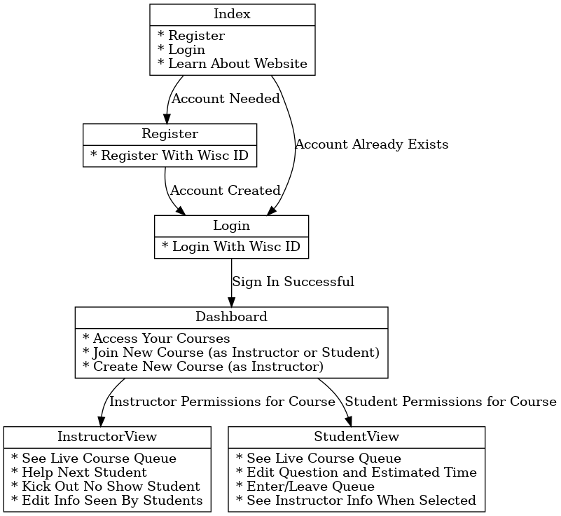
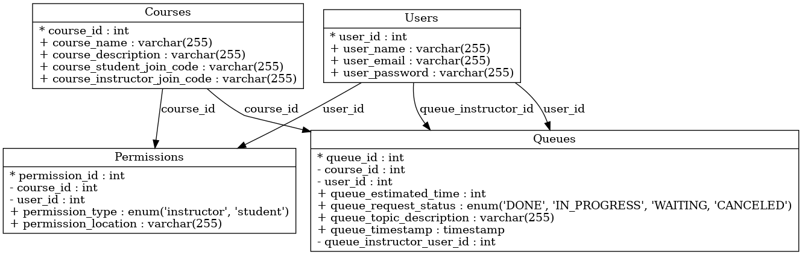

# Welcome to `Waitlisters!`

Our web application is designed to help organize office hour waitlists equitably and efficiently, so students and instructors alike are freed to focus on the content at hand. Given our collective experience as students and peer mentors, we recognize the value of streamlining the management of a high student to instructor ratio, especially right before deadlines.

It will be available for use at `TODO`.

## Authors

Jacob Larget, Mayank Nayak, Eric Dubberstein, Connor Flint, Michael Brudos, and Kanishk Saxena.
- This project started while taking CS506 (Software Engineering) at UW-Madison in Spring 2023.

### Crediting

This code relies on the work of the larger open-source development community. We want to especially thank the developers of Docker, GitHub, OpenAI, Bootstrap, React, NodeJS, and MySQL for their efforts.

## Codebase Maintenance

### Run Full Codebase:

1. Make sure your terminal is in the main waitlisters directory (not waitlisters-backend, not waitlisters-frontend). Then run:
	- `docker compose up --build`
2. Ports/access:
	- The frontend should be running on localhost:3000
	- The backend should be running on localhost:8080
	- The database is not directly accessible from localhost. Instead, in a new terminal, run:
		`docker exec -it waitlisters-db-1 mysql -u root -ppassword`
		- This will open up a mysql terminal; A good test command set is:
`USE waitlist; SELECT * FROM Queues;`
3. Kill all running containers by pressing `Ctrl-C` in the terminal.
- To fully stop running the containers, go into the Docker GUI, make sure you are in the `Containers` section and under `Actions`, click `Stop`. 
	- This step may be needed to ensure proper database adjustments.

### Make Codebase Changes:
In the main directory, run:
1. `git pull`
	- This ensures that you are up to date if someone else added something
2. `git add *`
	- You can also run `git status` first to ensure what "all"(*) really means.
3. `git commit -m “<COMMIT-MESSAGE-HERE>” `
	- Replace `<COMMIT-MESSAGE-HERE>` with what you changed (functionality, not location).	
4. `git push`.
	- If you ran into problems in the above commands and aren’t sure why, ask!

# Technical Details

If you notice a mistake or want to try this out yourself, fork away! Note the diagrams below are made using `pydot` ( see `schema_drawer.py`)

@TODO: update these to use mermaid Markdown-ish syntax for rendering in browsers/screenshot insertion if necessary.

## Client Accessibility (UX)

### Page Schema

## Server Storage (DB)

### Database Schema

## Network Security (Pen Testing)

We will use a `.env` file to hide the secrets needed to connect to our database, and `OAuth` through Google's services to attempt to mitigate unwelcome visitors.

* We will use `Synk` and GitHub's `Dependabot` to test for network security.

## Production Support (CI/CD)

This is coming soon to our GitHub workflow!

* We will use `Lighthouse` for Accessibility and Performance Metrics.

# Further Improvements

See our living backlog [here](https://docs.google.com/spreadsheets/d/1pgrmx3J7-0h1hmzTBVAJzuEH_yD-Rbgq2Av7DAyvyyA/edit?usp=sharing).

